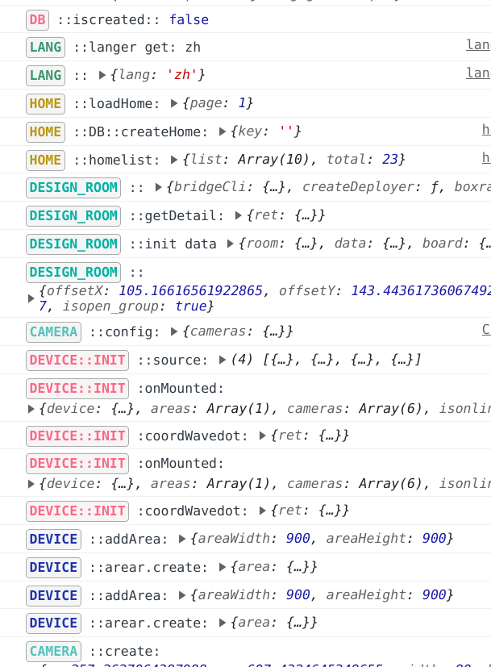

## log-tag
> 无侵入, prod 编译清除console 即可删除日志代码


### Install
```bash
yarn add browser-log-tag --dev
```

### Usage
- rollup or vite 

1. build config
```js
import Logtag from 'browser-log-tag'
{
  ...
  plugins: [Logtag({ fname = "Logtag" })]
  ...
}


```

2. code config
```js
import { format } from 'browser-log-tag'

export const Logtag = format([you theme])

```
